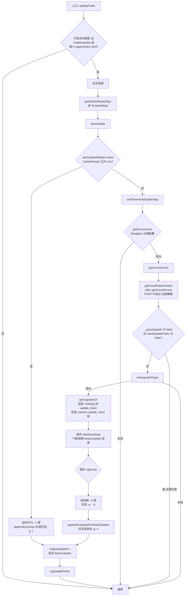

```mermaid
flowchart TD
    A[入口: updatePublic] --> B{开启自动更新 且<br/>enableUpdate 或<br/>缺少 pages/index.html?}
    B -->|否| Z[结束]
    B -->|是| C[后台线程]
    C --> D[getUpdateReadySign<br/>读 TempSettings]
    D --> E[startUpdate]

    E --> F{startUpdateReplace false<br/>UpdateReady 已为 true?}
    F -->|是| G[组命令行: -u 等<br/>appendGrayArgs 灰度时加 -g -v]
    G --> H[beginUpdatePro<br/>启动 IteachUpdate]
    H --> I[sigUpdateFinish]
    I --> Z

    F -->|否| J[startDownloadUpdateApp]
    J --> K{getEnvironment<br/>Navigator 云端配置}
    K -->|失败| Z
    K -->|成功| L[getLocalVersion]
    L --> M[getCloudPublicVersion<br/>Utils::getCloudVersion<br/>POST 升级点 全国策略]
    M --> N{_grayUpgrade 为 false<br/>且 needUpdatePublic 为 false?}
    N -->|是 无需升级| Z
    N -->|否| O[initUpgradePlugin]
    O -->|失败| Z
    O -->|成功| P[getUpgradeUrl<br/>全国: Settings 的 update_client<br/>灰度: params.update_client 等]
    P --> Q[插件 startDownload<br/>下载/替换 IteachUpdate 目录]
    Q --> R{插件 sigFinish}
    R --> S[组参数: -d 等<br/>可选 -u、-h]
    S --> T[appendGrayArgsForIteachUpdate<br/>仅灰度追加 -g -v]
    T --> H
```
