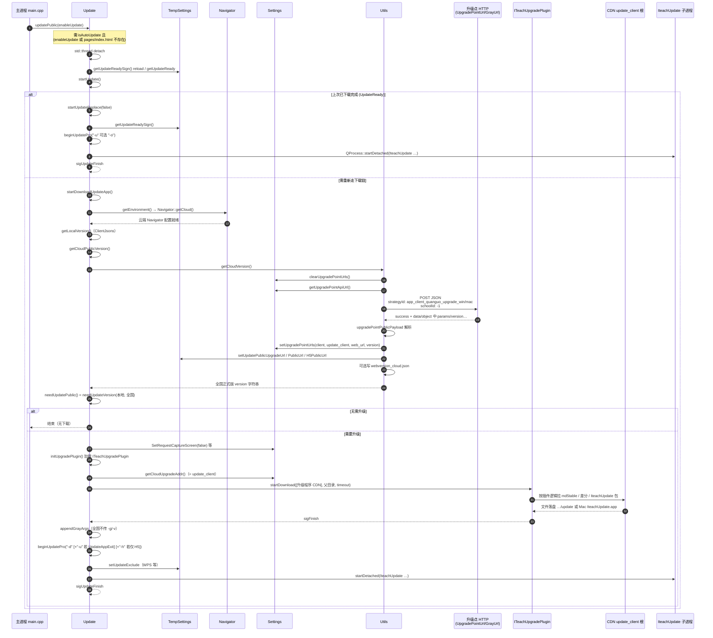

```mermaid
sequenceDiagram
    autonumber
    participant Main as 主进程 main.cpp
    participant Up as Update
    participant Temp as TempSettings
    participant Nav as Navigator
    participant Set as Settings
    participant U as Utils
    participant API as 升级点 HTTP<br/>(UpgradePointUrl/GrayUrl)
    participant Plg as ITeachUpgradePlugin
    participant CDN as CDN update_client 根
    participant IU as IteachUpdate 子进程

    Main->>Up: updatePublic(enableUpdate)
    Note over Up: 需 isAutoUpdate 且<br/>(enableUpdate 或 pages/index.html 不存在)

    Up->>Up: std::thread detach
    Up->>Temp: getUpdateReadySign() reload / getUpdateReady
    Up->>Up: startUpdate()

    alt 上次已下载完成 (UpdateReady)
        Up->>Up: startUpdateReplace(false)
        Up->>Temp: getUpdateReadySign()
        Up->>Up: beginUpdatePro("-u" 可选 "-o")
        Up->>IU: QProcess::startDetached(IteachUpdate …)
        Up-->>Up: sigUpdateFinish
    else 需重新走下载链
        Up->>Up: startDownloadUpdateApp()
        Up->>Nav: getEnvironment() → Navigator::getCloud()
        Nav-->>Up: 云端 Navigator 配置就绪

        Up->>Up: getLocalVersion()（ClientJsons）
        Up->>Up: getCloudPublicVersion()
        Up->>U: getCloudVersion()
        U->>Set: clearUpgradePointUrls()
        U->>Set: getUpgradePointApiUrl()
        U->>API: POST JSON<br/>strategyId: app_client_quanguo_upgrade_win/mac<br/>schoolId: -1
        API-->>U: success + data/object 中 params/version…
        U->>U: upgradePointPublicPayload 解析
        U->>Set: setUpgradePointUrls(client, update_client, web_url, version)
        U->>Temp: setUpdatePublicUpgradeUrl / PublicUrl / H5PublicUrl
        U->>U: 可选写 webversion_cloud.json

        U-->>Up: 全国正式版 version 字符串
        Up->>Up: needUpdatePublic() = needUpdateVersion(本地, 全国)
        alt 无需升级
            Up-->>Main: 结束（无下载）
        else 需要升级
            Up->>Set: SetRequestCaptureScreen(false) 等
            Up->>Up: initUpgradePlugin() 加载 ITeachUpgradePlugin
            Up->>Set: getCloudUpgradeAddr()（= update_client）
            Up->>Plg: startDownload([升级程序 CDN], 父目录, timeout)

            Plg->>CDN: 按插件逻辑拉 md5table / 差分 / IteachUpdate 包
            CDN-->>Plg: 文件落盘 …/update 或 Mac IteachUpdate.app

            Plg-->>Up: sigFinish
            Up->>Up: appendGrayArgs（全国不传 -g/-v）
            Up->>Up: beginUpdatePro("-d" [+"-u" 若 UpdateAppExit] [+"-h" 若仅 H5])
            Up->>Temp: setUpdateExclude（WPS 等）
            Up->>IU: startDetached(IteachUpdate …)
            Up-->>Up: sigUpdateFinish
        end
    end
```
